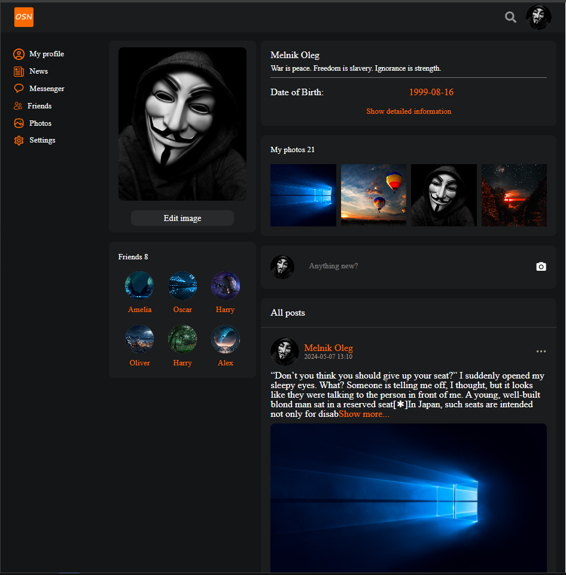
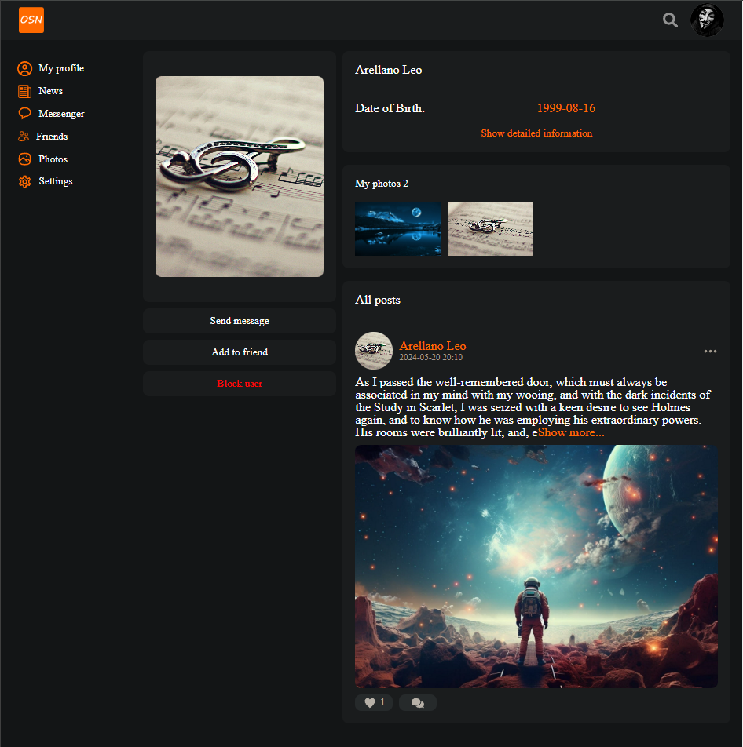
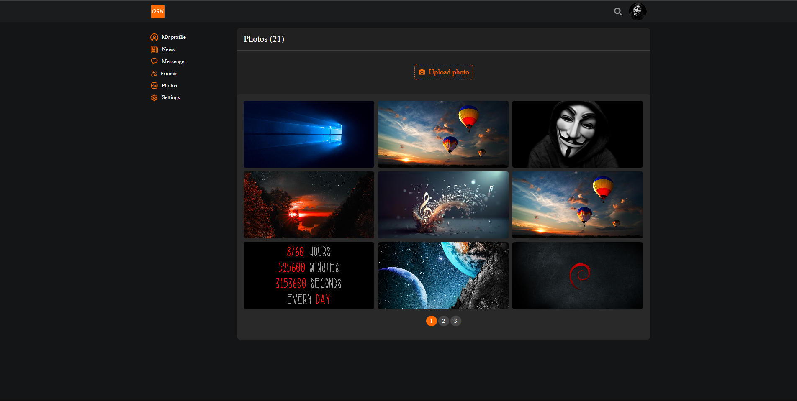
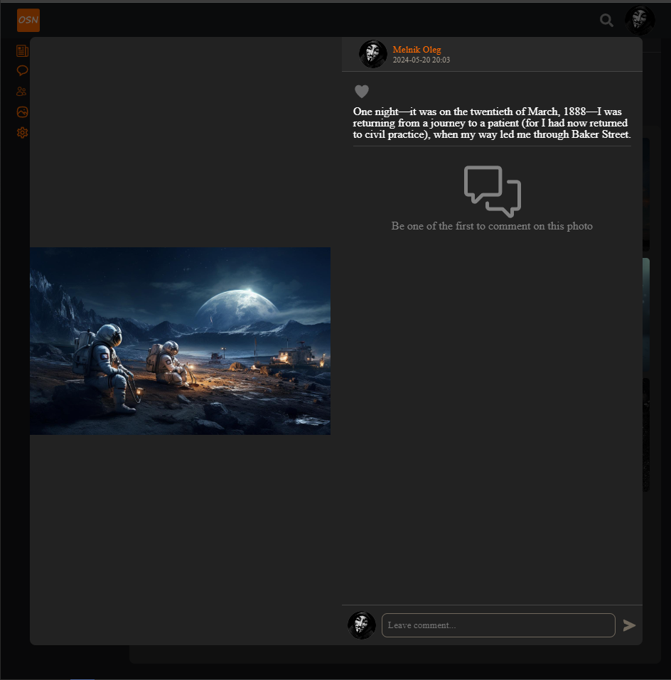
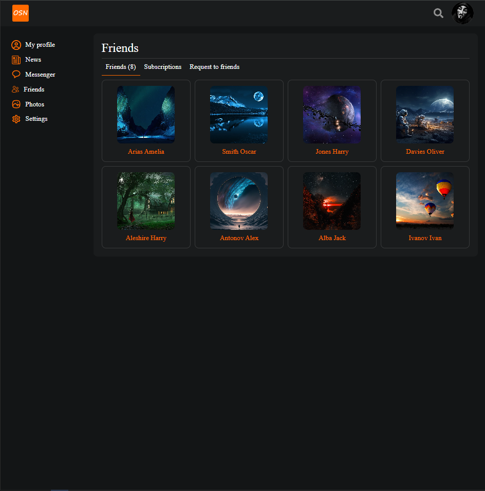
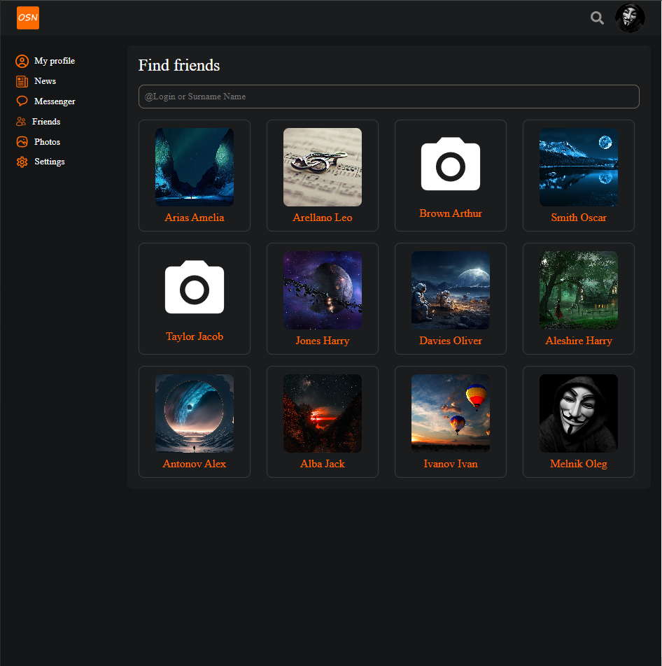
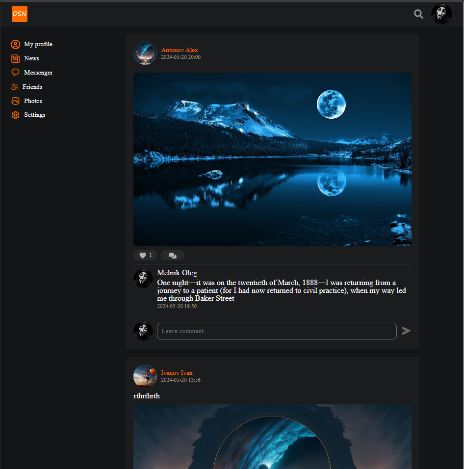
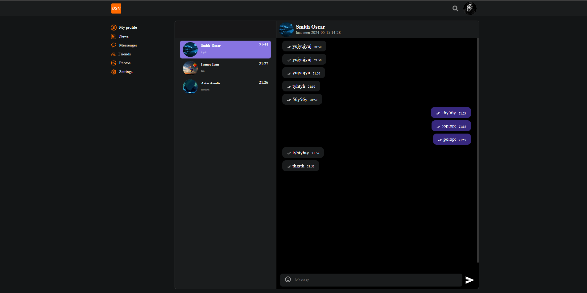

# Social-network
An online platform that is used for communication, dating, creating social relationships between people who have similar interests or offline connections, as well as for entertainment and work.

#### User page:


#### User:


#### Photo page:


#### Current photo page:


#### Friends page:


#### Search page:


#### News page:


#### Chat page:


## Installation Guide

### Requirements
- [Nodejs](https://nodejs.org/en/download)
- [PostgreSQL](https://www.postgresql.org/download/)

Both should be installed and make sure postgreSQL is running.

```shell
git clone https://github.com/xkz1899/social-network.git
cd social-network
```

Install the dependencies.

```shell
cd server
npm install
cd ../client
npm install
cd ..
```
#### Create a database named "social" in the database postgreSQL.

#### Start server.

```shell
cd server
npm start
```

#### Start client.

```shell
cd client
npm start
```

Now open http://localhost:3000 in your browser.

The first registered user to receive administrator status.
